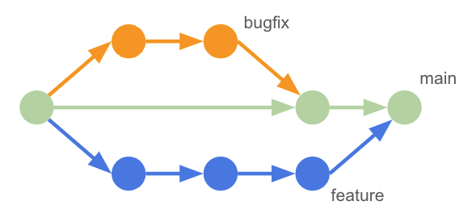
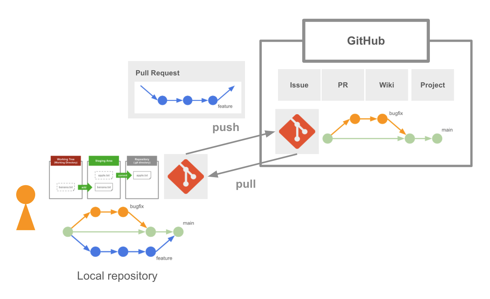

# Gitの基礎

## Agenda

* Git
    * リポジトリ
    * 分散型バージョン管理システム
    * ブランチ
* GitHub
    * GitHub上で利用可能なサービス
    * プルリクエスト

---

## Git

+ プログラムのソースコードなどの分散型のバージョン管理システム
+ いつ・だれが・なにを・どのような理由で更新したのかを記録できる
+ Gitは複数のリポジトリ間でコードを同期できる

> Gitを使うことでソフトウェアやドキュメントのバージョン管理が可能となります。バージョン管理することで、ある時点のソフトウェアに差し戻す、といったことも容易になります。参考：Git ロゴ：https://git-scm.com/downloads/logos

---

### リポジトリ

+ ソースコードなどの成果物を保存する仕組み
+ Gitはリポジトリに追加したファイルの更新履歴を管理する
+ Gitはリポジトリにファイルを追加するためのステージングエリアを提供する

> Gitではリポジトリにファイルを追加することを**コミット**と呼びます。またGitでは作成したファイルをリポジトリに直接コミットするのではなく、ステージングエリアに昇格したファイルだけをコミットできます。ステージングエリアを使うことで、必要なファイルだけを選択してコミットできるようになります。

### "分散型" バージョン管理システム

+ 開発者が個人単位でローカルにリポジトリを持つため、同時開発が促進される
+ 開発者は任意のタイミングでローカルリポジトリとリモートリポジトリで同期をとる（push / pull）
+ 複数の開発者が同じ時期に同じファイルを修正すると競合（コンフリクト）が発生する

> 

---

### ブランチ

+ Gitのブランチを使って開発することで、実験的な機能を開発したり、優先度の高いバグフィックスの対応をしたり、柔軟な開発を進めることができる
+ プロダクトの中心となるブランチを `main` ブランチと呼ぶことが多い
+ 動作検証を終えたブランチのコードを `main` ブランチにマージする（反映する）ことでプロダクトをバージョンアップさせる

> ブランチとは枝という意味です。一般的に、開発者は割り当てられたタスク（チケット）ごとにブランチを用意することが多いです。

---

## GitHub

+ Gitをサポートする開発者向けのプラットフォーム
+ アカウントを作成すればGitHub上にGitリポジトリを作成できる
+ 開発者はローカルのGitリポジトリでコードを作成し、任意のタイミングでGitHubのリポジトリと同期をとる

---

### GitHub上で利用できるサービス

+ GitHubはGitの周辺作業をサポートする
    + リポジトリの作成
    + Issue管理
    + プルリクエスト
    + Wiki
    + プロジェクト管理など

---

### プルリクエスト

+ GitHubではプロダクトに反映したい更新（ソースコードの差分や、更新内容のメッセージなど）をプルリクエストと呼ぶ
+ 一般的にプルリクエストを送った人物とは異なる人物がプルリクエストをレビューし、問題がなければ `main` ブランチに更新を反映する（マージする）
+ 具体的には開発者は `main` ブランチと異なるブランチを用意してプログラムを修正し、ブランチをGitHubに追加することでプルリクエストを作成する

> GitHub上でプルリクエストが発生すると、開発者間でコードレビューを行うことができます。

---