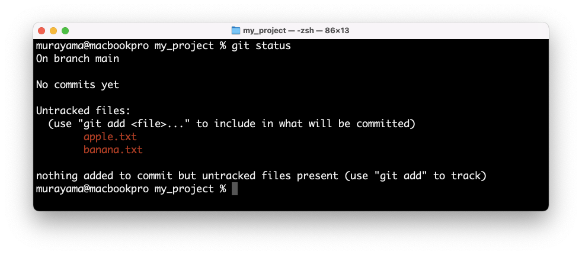
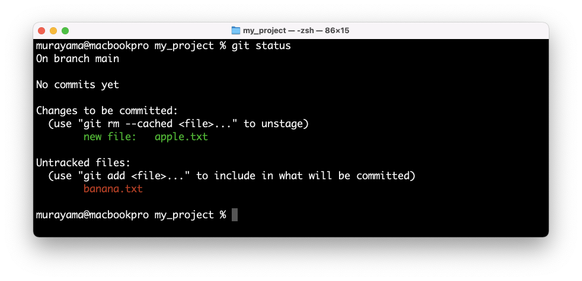
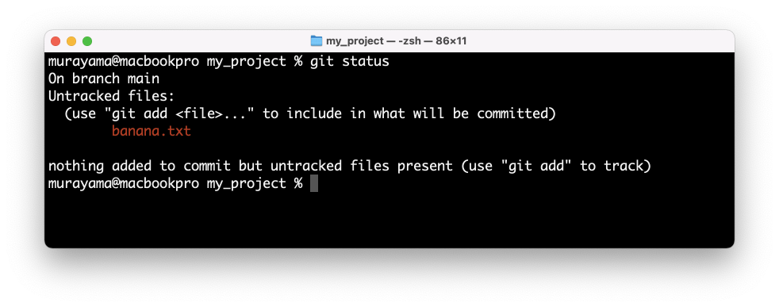
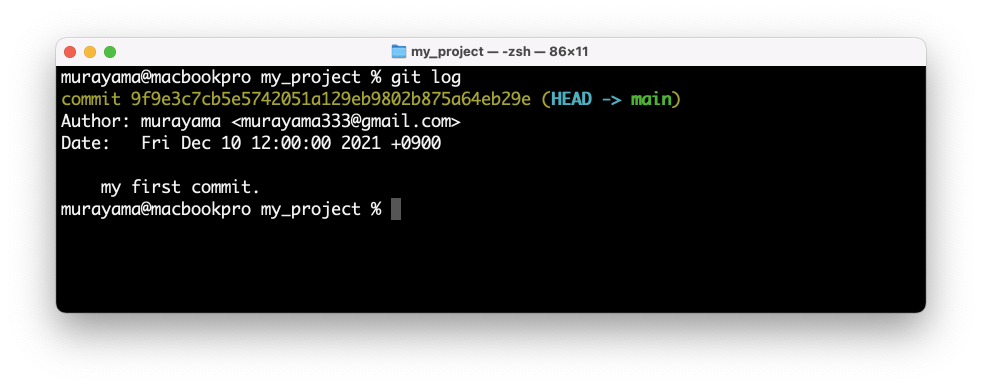
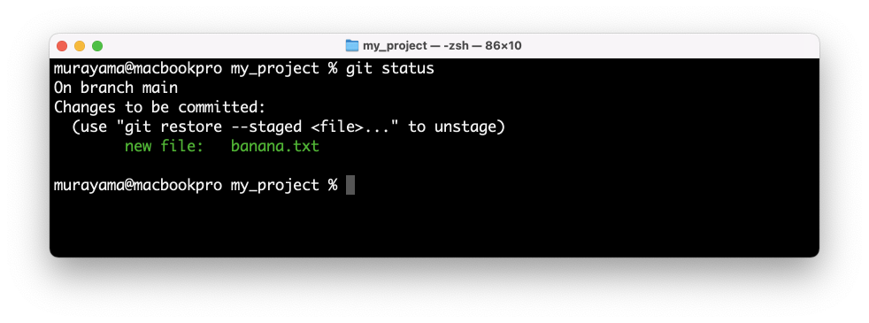
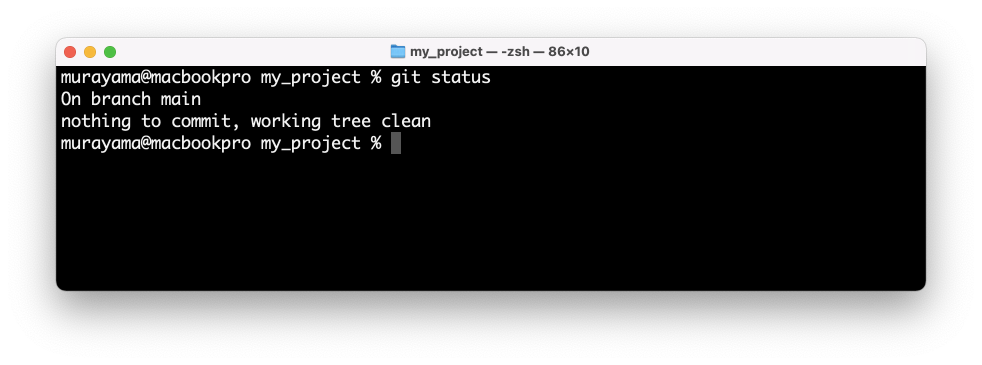
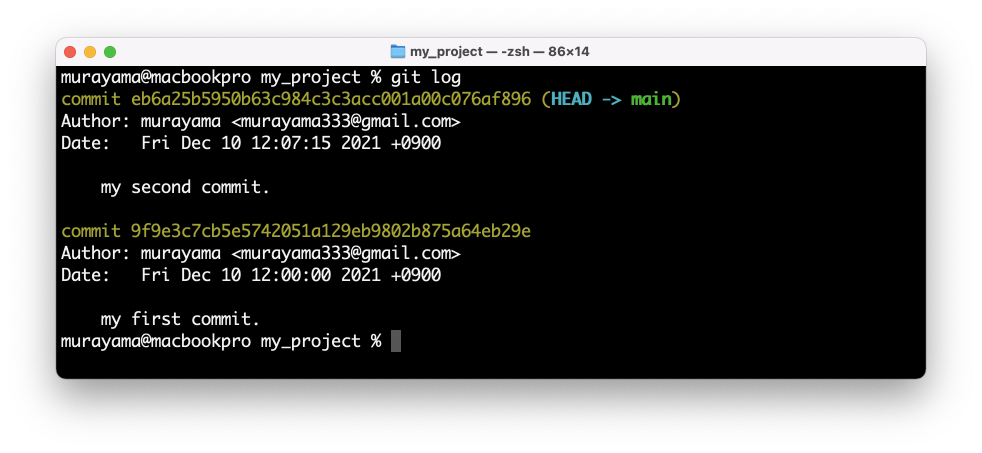

# Git - チュートリアル1

## Agenda

* **Gitの使い方1 - ローカル編**
* Gitの使い方2 - リモート編
* Gitの使い方3 - ローカル（ブランチ）編
* Gitの使い方4 - リモート（ブランチ）編

---

## Gitの使い方1 - ローカル編

1. Gitインストール後の初回のみ
    + `git config` - 開発者の名前・メールアドレス等の情報を登録
2. プロジェクト作成時（新規開発の場合）
    + `git init` - ローカルにリポジトリを作成する
3. 開発時
    + `git add` - ワーキングツリーの修正をステージングに追加する
    + `git commit` - ステージングにある更新をローカルリポジトリに反映する
    + `git status` - リポジトリの状態を確認する
    + `git log` - リポジトリの更新履歴を確認する

---

## チュートリアル

### 1. Gitインストール後の初回のみ 

```
% git config --global user.name "murayama"
% git config --global user.email murayama333@gmail.com
```

### 2. プロジェクト作成時（新規開発の場合）

`cd` コマンドを使って、Gitの管理対象とするフォルダに移動します。

```
% cd my_project
```

> ここでは `my_project` という名前のフォルダがあるものとします。

`my_project` フォルダに移動したら `git init` コマンドでローカルリポジトリを作成します。

```
% git init
Initialized empty Git repository in /Users/murayama/Desktop/my_project/.git/
```

> 上記のようなメッセージが表示されればOKです。

### 3. 開発時

> 通常はVisual Studio等のテキストエディタでファイル（プログラム）を作成します。ここではターミナルから小さなファイルを作成してGitの使い方を学習します。

`apple.txt` ファイルを作成する

```
% echo Apple > apple.txt
```

`banana.txt` ファイルを作成する

```
% echo Banana > banana.txt
```

> `ls` コマンドで確認すると2つのファイルが生成されたことを確認できます。

ローカルリポジトリの状態を確認する

```
% git status
On branch main

No commits yet

Untracked files:
  (use "git add <file>..." to include in what will be committed)
	apple.txt
	banana.txt

nothing added to commit but untracked files present (use "git add" to track)
```



> 新規作成したファイルを2つ確認できます。これら2つのファイルはまだリポジトリに登録されていないことがわかります。


`apple.txt` ファイルをステージングする（ `banana.txt` ファイルはステージングしない）

```
% git add apple.txt
```

再度、ローカルリポジトリの状態を確認する

```
% git status
On branch main

No commits yet

Changes to be committed:
  (use "git rm --cached <file>..." to unstage)
	new file:   apple.txt

Untracked files:
  (use "git add <file>..." to include in what will be committed)
	banana.txt

```



> apple.txt ファイルがステージングエリアに追加されたことがわかります。

ステージングエリアの更新をローカルリポジトリに反映する

```
% git commit -m "my first commit."
[main (root-commit) 9f9e3c7] my first commit.
 1 file changed, 1 insertion(+)
 create mode 100644 apple.txt
```

再度、ローカルリポジトリの状態を確認する

```
% git status
```



> `apple.txt` ファイルがローカルリポジトリに反映されたので、差分として表示されなくなります。

ローカルリポジトリの更新履歴を確認する

```
% git log
commit 9f9e3c7cb5e5742051a129eb9802b875a64eb29e (HEAD -> main)
Author: murayama <murayama333@gmail.com>
Date:   Fri Dec 10 12:00:00 2021 +0900

    my first commit.
```



> ここまでで Git の基本的な操作は完了です。おつかれさまでした。2つ目の `banana.txt` ファイルも同様にリポジトリにコミットします。

`banana.txt` ファイルをステージングエリアに追加する

```
% git add banana.txt
```

ローカルリポジトリの状態を確認する

```
% git status
```



> `banana.txt` ファイルがステージングエリアに追加されたことがわかります。

ステージングエリアの更新をローカルリポジトリに反映する

```
% git commit -m "my second commit."
[main eb6a25b] my second commit.
 1 file changed, 1 insertion(+)
 create mode 100644 banana.txt
```

ローカルリポジトリの状態を確認する

```
% git status
```



> ローカルリポジトリとワーキングツリー（ステージングエリア）との差分がなくなったことがわかります。

ローカルリポジトリの更新履歴を確認する

```
% git log
```



---

