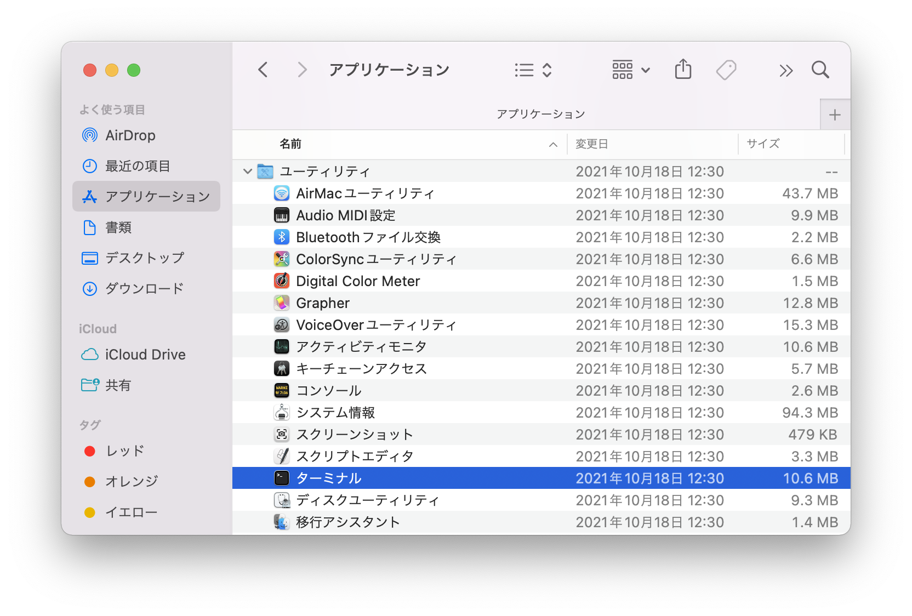
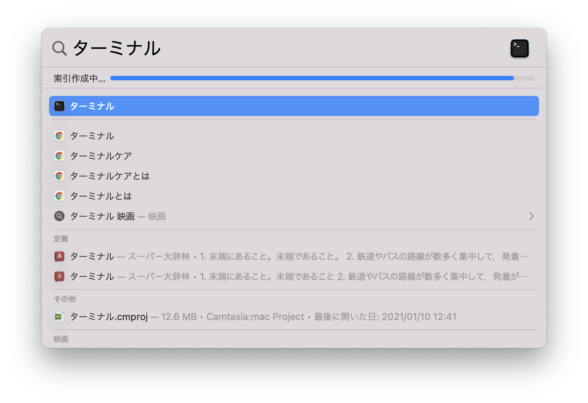

# ターミナルの基本操作

## Agenda

* ターミナルとは 
* Macのファイルシステム
* これだけ覚えておけばOKなコマンド3つ
* 追加で覚えておくと便利なコマンド4つ

---

## ターミナルとは

* コンピュータ（Mac）をコマンドで操作するツール
* ターミナルでできることは Finder とほとんど同じ
* 一言でいえばマウスで操作するのがFinder、キーボードで操作するのがターミナル

> なぜマウスで操作するのではなくキーボードで操作するのでしょうか。

### ターミナルの起動方法

* Finder を開いて「アプリケーション => ユーティリティ => ターミナル」を起動



> スポットライトを起動して「ターミナル」と打ち込んでもOK



---

## Macのファイルシステム

* ファイルシステムはフォルダやファイルといった仕組みを提供する（OSの一部）
* ファイルシステムにおいてファイルやフォルダの場所を指差すために "パス" を使う
* Macのファイルシステムは以下のとおり

```
/
  Library/
  System/
  Users/
    murayama/
      Applications/
      Desktop/
        my_folder/
      Documents/
      Downloads/
      Library/
      Movies/
      Music/
      Pictures/
      Public/
      opt/
  Volumes/
  ...省略
  var/
```

> Windows は `C:¥` のようなフォルダがルートフォルダになりますが、Macの場合は `/` がルートフォルダになります。フォルダ名やファイル名は大文字小文字の違いにも注意してください。

### 作業フォルダについて（Working Directory）

+ 実行中のプログラムにおいて起点となるフォルダのこと

> Finderもターミナル常にどこか一つのフォルダを参照しています。現在、参照しているフォルダのことを作業フォルダやカレントフォルダなどと呼びます。

### パス（Path）について

+ ファイルシステム上のファイルやフォルダの場所を示すもの
+ パスの指定には 絶対パス指定 と相対パス指定がある
    + 絶対パスとは `ルートフォルダ` からのパス指定
    + 相対パスとは `作業フォルダ` からのパス指定

#### 例：デスクトップにある `my_folder` のパス指定

+ 絶対パスとは `ルートフォルダ / `  からのパス指定

    ```
    /Users/murayama/Desktop/my_folder
    ```

+ 相対パスとは `作業フォルダ` からのパス指定

    ```
    （作業フォルダが /Users/murayama の場合）
    Desktop/my_folder
    ```

---

## これだけ覚えておけばOKなコマンド3つ

### `pwd` コマンド

* 作業フォルダのパスを表示する

```
% pwd                      
/Users/murayama
```

### `ls` コマンド

* 作業フォルダの中身を表示する

```
% ls
Applications	Documents	Library		Music		Public
Desktop		Downloads	Movies		Pictures	opt
```

### `cd` コマンド

* 作業フォルダを移動する

```
% cd Desktop
% pwd
/Users/murayama/Desktop
```

> `cd` コマンドはスペースを空けて、移動先フォルダのパスを指定します。パス指定は絶対パス指定でも相対パス指定でも大丈夫です。`cd` コマンドの実行後に `pwd` コマンドを入力すると作業フォルダが移動したことを確認できます。


---

## 追加で覚えておくと便利なコマンド4つ


### `mkdir` コマンド

* フォルダを作成する

```
% mkdir apple banana cherry
```

### `echo` コマンド

* メッセージを出力する

```
% echo Hello
Hello
```

* `> ファイル名` とするとファイルにメッセージを出力できる

```
% echo Hello > hello.txt
```

+ `ls` コマンドでファイルが生成されたことを確認できる

```
% ls
hello.txt
```

* `cat` コマンドでファイルの中身を表示できる

```
% cat hello.txt
```

### `open` コマンド

* 指定したパスを関連するアプリケーションで開く

```
% open .
```

> `.` は作業フォルダ（カレントフォルダ）を意味します。Macの場合は上記のコマンドで作業フォルダをFinderで開けます。

### `curl` コマンド

* URLにアクセスする

```
% curl https://codeguide.jp
... 省略

</body>
</html>
murayama@macbookpro ~ % 
```

---