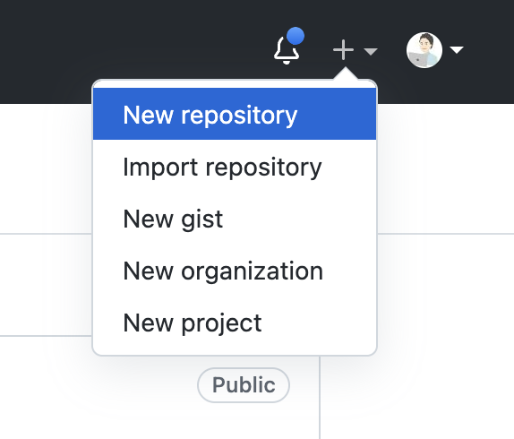
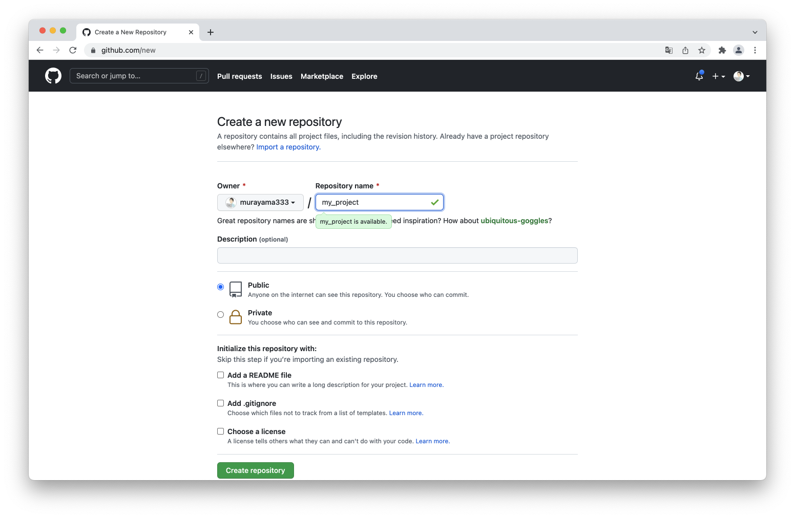
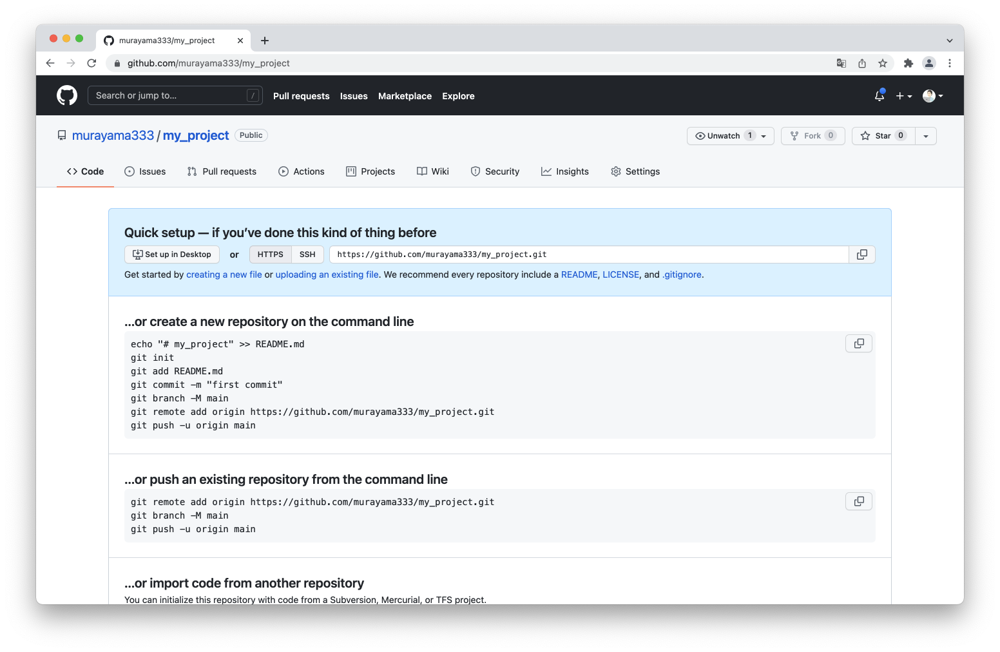
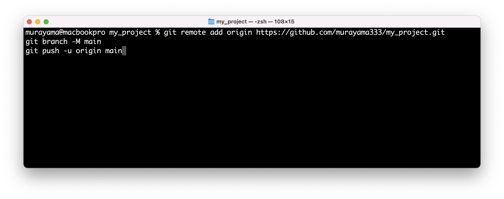
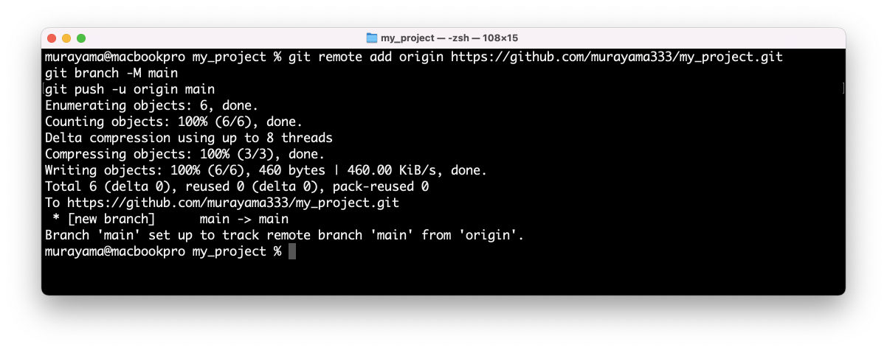
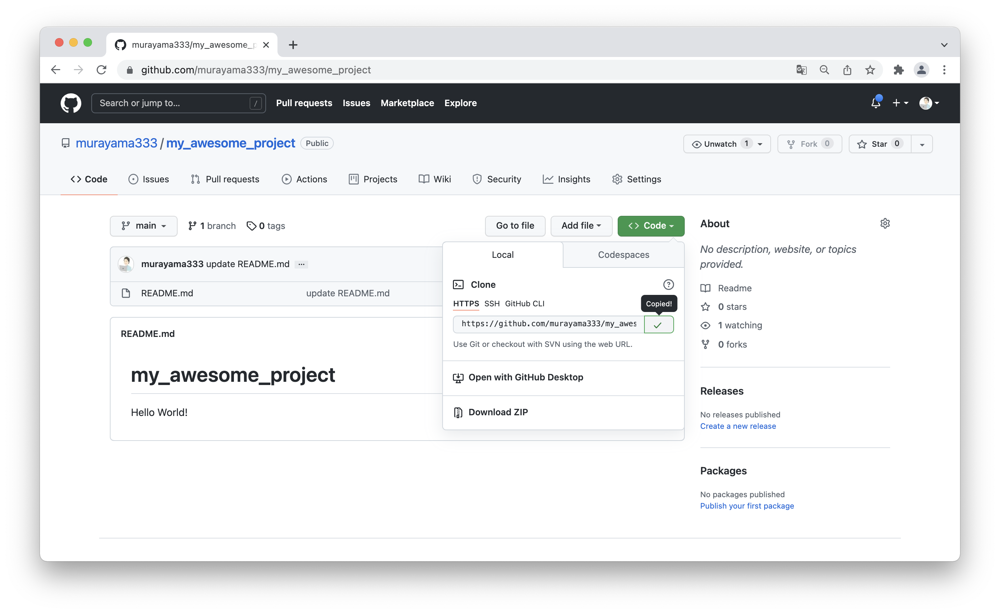
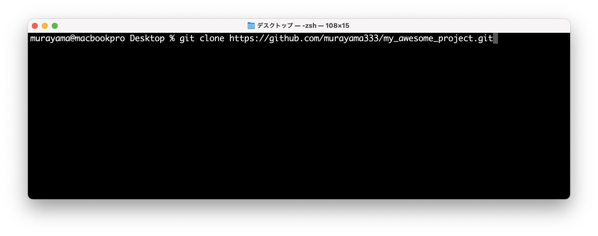
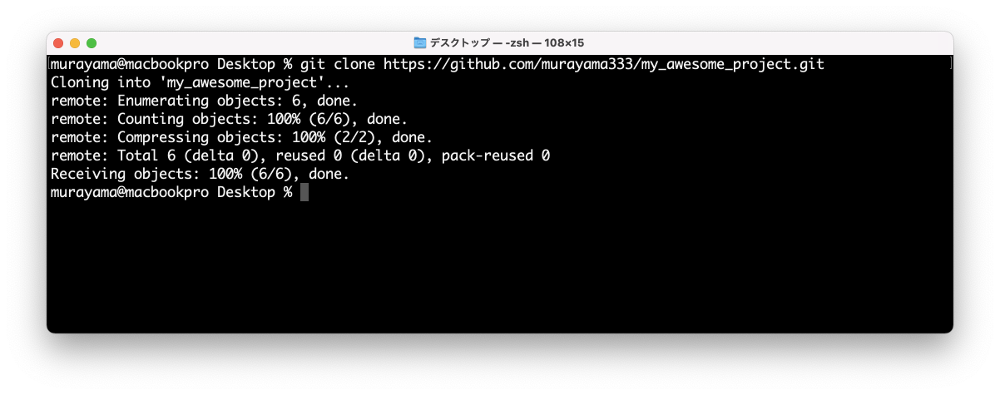

# Git - チュートリアル

## Agenda

* Gitの使い方1 - ローカル編
* **Gitの使い方2 - リモート編**
    * GitHubにリポジトリ存在しない場合
    * GitHubにリポジトリが既に存在する場合
* Gitの使い方3 - ローカル（ブランチ）編
* Gitの使い方4 - リモート（ブランチ）編

---

## Gitの使い方2 - リモート編 - GitHubにリポジトリ存在しない場合

1. 事前準備
    + GitHubなどを使ってリモートリポジトリを作成しておく
2. 初回のみ
    + `git remote` - ローカルリポジトリにリモートリポジトリを関連づける
3. 開発時
    + `git push` - ローカルリポジトリの更新をリモートリポジトリに反映する

---

## チュートリアル

### 1. 事前準備

GitHubなどを使ってリモートリポジトリを作成します。

GitHub のメニューから New repository を選択する



プロジェクト名を入力して Create Repository ボタンをクリックする



> ここでは `my_project` という名前にしています。ローカルのプロジェクトと同名である必要はありませんが、似たような名前になることが多いです。

次のような画面が表示されれば GitHub上にリポジトリの作成は完了です。



> 現時点ではリポジトリの中身は空なので、表示された画面から ...or push an exsiting repository from command line に表示されているコマンドをコピーします。ここでコピーした内容を後ほどターミナルに貼り付けて実行します。

---

### 2. 初回のみ 3. 開発時

GitHubでコピーした内容をターミナルに貼り付けて、以下の操作をまとめて実行します。

+ `git remote` - ローカルリポジトリにリモートリポジトリを関連づける
+ `git push` - ローカルリポジトリの更新をリモートリポジトリに反映する

GitHubからコピーした内容を貼り付けます。

```
git remote add origin https://github.com/murayama333/my_project.git
git branch -M main
git push -u origin main
```



コピーしたコマンドの内容は以下のとおり

```
# ローカルリポジトリにリモートリポジトリを関連づける
# (origin という名前で https://github.com/murayama333/my_project.git を参照する)
git remote add origin https://github.com/murayama333/my_project.git

# 現在のブランチ名を main ブランチに更新する
git branch -M main

# ローカルの main ブランチを リモートリポジトリ（origin）に追加する
git push -u origin main
```

コピーした内容を貼り付けてEnterキーを押すとGitHub上のリポジトリに更新が反映される（pushされる）




---

## Gitの使い方2 - リモート編 - GitHubにリポジトリが既に存在する場合

1. 初回のみ
    + `git clone` - リモートリポジトリをローカルに複製する
2. 開発時
    + `git pull` - リモートリポジトリの更新をローカルリポジトリに反映する

---

## チュートリアル

### 1. 初回のみ

GitHubの既存のプロジェクト（リポジトリ）にアクセスして、Codeボタンから Clone URL をコピーする



ターミナルに `git clone ` と入力してからコピーした内容を貼り付ける

> 注意：`cd` コマンドで作業フォルダを デスクトップ に移動してから作業してください。

```
% git clone https://github.com/murayama333/my_awesome_project.git
````



コピーした内容を確認してEnterキーをタイプするとローカルにリポジトリが複製される



### 2. 開発時

開発中は他の開発者によってGitHub上のリポジトリが更新されるので、最新のコードを取得するには以下のように `git pull` コマンドを入力する

```
% git pull origin main
From https://github.com/murayama333/my_awesome_project
 * branch            main       -> FETCH_HEAD
Updating fb18b6b..a87b9fe
Fast-forward
 README.md | 2 ++
 1 file changed, 2 insertions(+)
murayama@macbookpro my_awesome_project % 
```

> `git pull リモートリポジトリ名 ブランチ名` で記述します。
