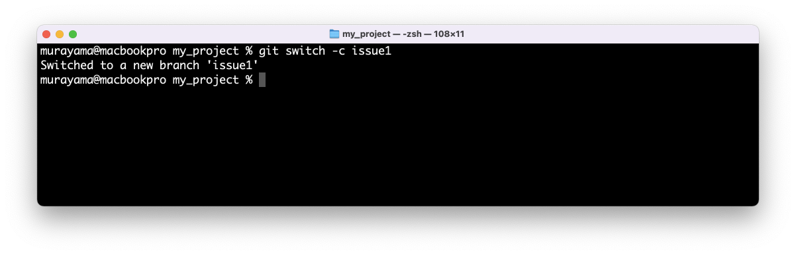

# Git - チュートリアル

## Agenda

* Gitの使い方1 - ローカル編
* Gitの使い方2 - リモート編
* **Gitの使い方3 - ローカル（ブランチ）編**
* Gitの使い方4 - リモート（ブランチ）編

---

## Gitの使い方3 - ローカル（ブランチ）編

+ ブランチを切って開発する場合
    + `git branch` - ブランチ一覧を確認する
    + `git switch` - ブランチを切り替える（作成する）
    + `git merge` - 他のブランチの更新を現在のブランチに反映する

---

## チュートリアル

### ブランチを切って開発する場合

ここでは以下の手順を確認します。

1. ローカルリポジトリに `issue1` ブランチを作成する
2. `issue1` ブランチで `orange.txt` ファイルを追加する（ `commit` する）
3. `main` ブランチに切り替える
4. ローカルリポジトリに `bugfix1` ブランチを作成する
5. `bugfix1` ブランチで `apple.txt` ファイルを修正する（ `commit` する）
6. `master` ブランチに切り替える
7. `master` ブランチに `buggix1` ブランチをマージする
8. `issue1` ブランチに切り替える
9. `issue1` ブランチで `lemon.txt` ファイルを追加する（ `commit` する）
10. `master` ブランチに切り替える
11. `master` ブランチに `issue1` ブランチをマージする
12. `master` ブランチを リモートリポジトリ（`orign`） に反映する（ `push` する）

---

#### 1. ローカルリポジトリに `issue1` ブランチを作成する

ローカルリポジトリのブランチ一覧を確認する。

```
% git branch
* main
```


> 現時点では `main` ブランチを確認できます。

`git switch` コマンドで `issue1` ブランチを作成する。

```
% git switch -c issue1
Switched to a new branch 'issue1'
```



> `git branch` コマンドに -c オプションをつけると新規ブランチを作成します。

ローカルリポジトリのブランチ一覧を確認する。

```
% git branch
* issue1
  main
```


> あらたに `issue1` ブランチが追加されたことがわかります。また `issue1` ブランチが選択されていることがわかります。


---

#### 2. `issue1` ブランチで `orange.txt` ファイルを追加する（ `commit` する）

`orange.txt` ファイルを作成してリポジトリにコミットする。

```
% echo Orange > orange.txt
% git add .
% git commit -m "add orange.txt"
[issue1 96002a7] add orange.txt
 1 file changed, 1 insertion(+)
 create mode 100644 orange.txt
```


`git log` コマンドでローカルリポジトリの更新履歴を確認する。

```
% git log --oneline 
96002a7 (HEAD -> issue1) add orange.txt
eb6a25b (origin/main, main) my second commit.
9f9e3c7 my first commit.
```

> `--oneline` オプションを付けると1件のコミットログを1行で表示します。


---

#### 3. `main` ブランチに切り替える

ここで優先度の高い修正作業が発生したものとして、あらたに `bugfix1` ブランチを作成したい。そのために一旦、`main` ブランチに切り替える

```
% git switch main
Switched to branch 'main'
Your branch is up to date with 'origin/main'.
```


`git log` コマンドでローカルリポジトリの更新履歴を確認する。

```
% git log --oneline 
eb6a25b (HEAD -> main, origin/main) my second commit.
9f9e3c7 my first commit.
```


> さきほどのコミット `96002a7 (HEAD -> issue1) add orange.txt` が存在しないのがわかります。

---

#### 4. ローカルリポジトリに `bugfix1` ブランチを作成する

`git switch` コマンドでバグフィックス用のブランチを作成する。

```
% git switch -c bugfix1
Switched to a new branch 'bugfix1'
```


`git branch` コマンドで現在のブランチ一覧を確認する。

```
% git branch
* bugfix1
  issue1
  main
```


---

#### 5. `bugfix1` ブランチで `apple.txt` ファイルを修正する（ `commit` する）

`apple.txt` ファイルの中身を "APPLE" に変更し、コミットする。

```
% echo APPLE > apple.txt
% git add .
% git commit -m "update apple.txt"
[bugfix1 e2aff71] update apple.txt
 1 file changed, 1 insertion(+), 1 deletion(-)
```


`git log` コマンドでローカルリポジトリの更新履歴を確認する。

```
% git log --oneline 
e2aff71 (HEAD -> bugfix1) update apple.txt
eb6a25b (origin/main, main) my second commit.
9f9e3c7 my first commit.
```


> あらたなコミットが追加されたのがわかります。

---

#### 6. `master` ブランチに切り替える

`bugfix1` ブランチで対応した修正を `main` ブランチに反映するため `main` ブランチに切り替える。

```
% git switch main
Switched to branch 'main'
Your branch is up to date with 'origin/main'.
```


`git branch` コマンドでブランチが変更されたことを確認する。

```
% git branch
  bugfix1
  issue1
* main
```


---

#### 7. `master` ブランチに `buggix1` ブランチをマージする

`main` ブランチ上で `git merge` コマンドを入力して `bugfix1` ブランチでの更新を反映する。

```
% git merge bugfix1
Updating eb6a25b..e2aff71
Fast-forward
 apple.txt | 2 +-
 1 file changed, 1 insertion(+), 1 deletion(-)
```


> ここでは Fast-forward と呼ばれるマージが行われています。

`git log` コマンドでリポジトリの更新履歴を確認する。

```
% git log --oneline 
e2aff71 (HEAD -> main, bugfix1) update apple.txt
eb6a25b (origin/main) my second commit.
9f9e3c7 my first commit.
```


> `bugfix1` ブランチで作成したコミットログが追加されているのがわかります。

---

#### 8. `issue1` ブランチに切り替える

次に以前の作業を再開するために `issue1` ブランチに切り替える。

```
% git switch issue1
Switched to branch 'issue1'
```


`git branch` コマンドでブランチが変更されたことを確認する。

```
% git branch
  bugfix1
* issue1
  main
```


---

#### 9. `issue1` ブランチで `lemon.txt` ファイルを追加する（ `commit` する）

`lemon.txt` ファイルを作成してリポジトリにコミットする。

```
% echo Lemon > lemon.txt
% git add .
% git commit -m "add lemon.txt"
[issue1 ec73060] add lemon.txt
 1 file changed, 1 insertion(+)
 create mode 100644 lemon.txt
```


`git log` コマンドでローカルリポジトリの更新履歴を確認する。

```
% git log --oneline                         
ec73060 (HEAD -> issue1) add lemon.txt
96002a7 add orange.txt
eb6a25b (origin/main) my second commit.
9f9e3c7 my first commit.
```


> 現時点で `bugfix1` ブランチで作成したコミットは存在しない点に注意してください。

---

#### 10. `master` ブランチに切り替える

`issue1` ブランチで対応した機能追加を `main` ブランチに反映するため `main` ブランチに切り替える。

```
% git switch main
Switched to branch 'main'
Your branch is ahead of 'origin/main' by 1 commit.
  (use "git push" to publish your local commits)
```


`git branch` コマンドでブランチが変更されたことを確認する。

```
% git branch
  bugfix1
  issue1
* main
```


---

#### 11. `master` ブランチに `issue1` ブランチをマージする

`main` ブランチ上で `git merge` コマンドを入力して `issue1` ブランチでの更新を反映する。

```
% git merge issue1
```


ここではマージコミットを作成することになるので、コミットメッセージを作成する。

```
Merge branch 'issue1'
# Please enter a commit message to explain why this merge is necessary,
# especially if it merges an updated upstream into a topic branch.
#
# Lines starting with '#' will be ignored, and an empty message aborts
# the commit.
```


コミットメッセージ(`Merge branch 'issue1'`)はデフォルトのままとする。ここではViエディタが起動しているのでESCキーを押して、`:wq` と入力してメッセージの入力を終了する。


メッセージの編集を終了するとマージ処理が確定する。

```
% git merge issue1
Merge made by the 'recursive' strategy.
 lemon.txt  | 1 +
 orange.txt | 1 +
 2 files changed, 2 insertions(+)
 create mode 100644 lemon.txt
 create mode 100644 orange.txt
```

`git log` コマンドでリポジトリの更新履歴を確認する。

```
% % git log --oneline --graph
*   3f0ac9e (HEAD -> main) Merge branch 'issue1'
|\  
| * ec73060 (issue1) add lemon.txt
| * 96002a7 add orange.txt
* | e2aff71 (bugfix1) update apple.txt
|/  
* eb6a25b (origin/main) my second commit.
* 9f9e3c7 my first commit.
```

> `--graph` オプションを付けることで、マージコミットによってブランチがマージされた様子を確認できます。

---

#### 12. `master` ブランチを リモートリポジトリ（`origh`） に反映する（ `push` する）

さいごに リモートリポジトリに ローカルリポジトリの更新（ `main` ブランチ）を `push` する。

```
% git push origin main
Enumerating objects: 13, done.
Counting objects: 100% (13/13), done.
Delta compression using up to 8 threads
Compressing objects: 100% (8/8), done.
Writing objects: 100% (11/11), 977 bytes | 977.00 KiB/s, done.
Total 11 (delta 3), reused 0 (delta 0), pack-reused 0
remote: Resolving deltas: 100% (3/3), done.
To https://github.com/murayama333/my_project.git
   eb6a25b..3f0ac9e  main -> main
```


