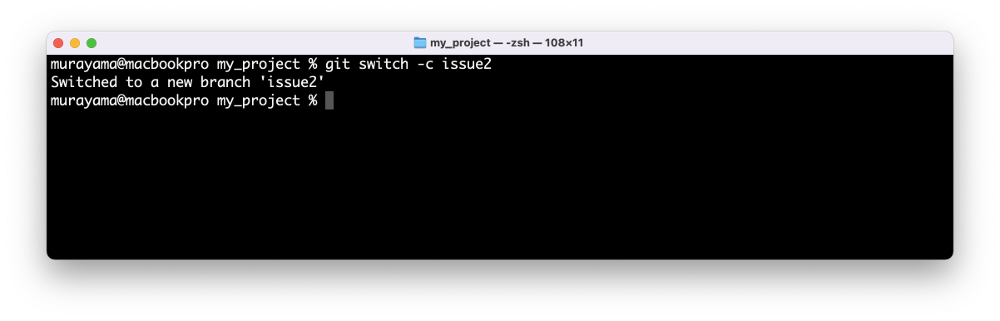
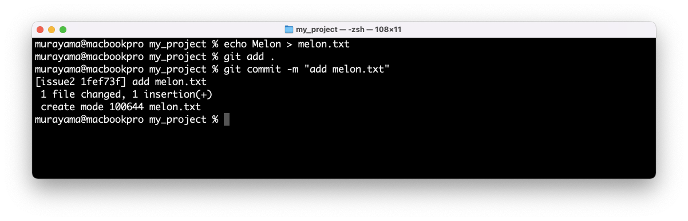
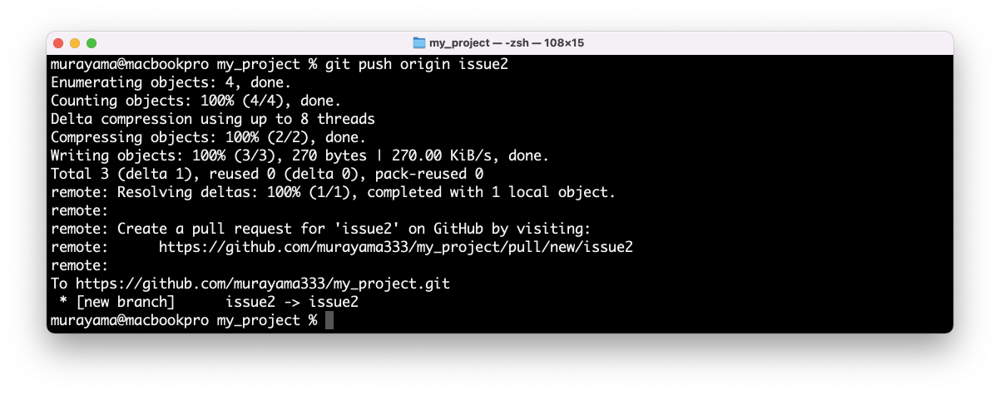
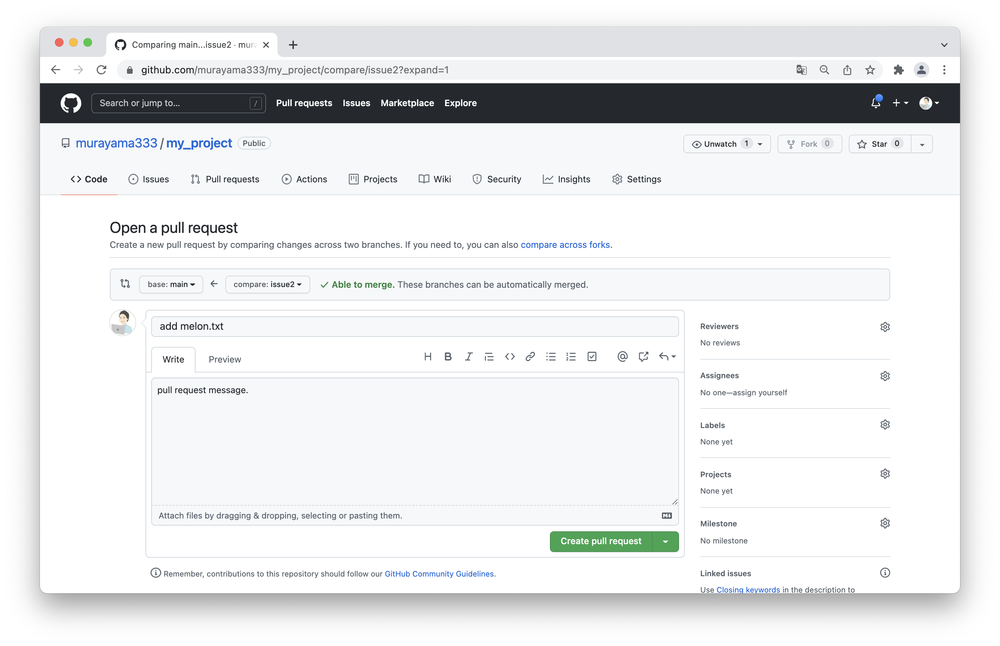
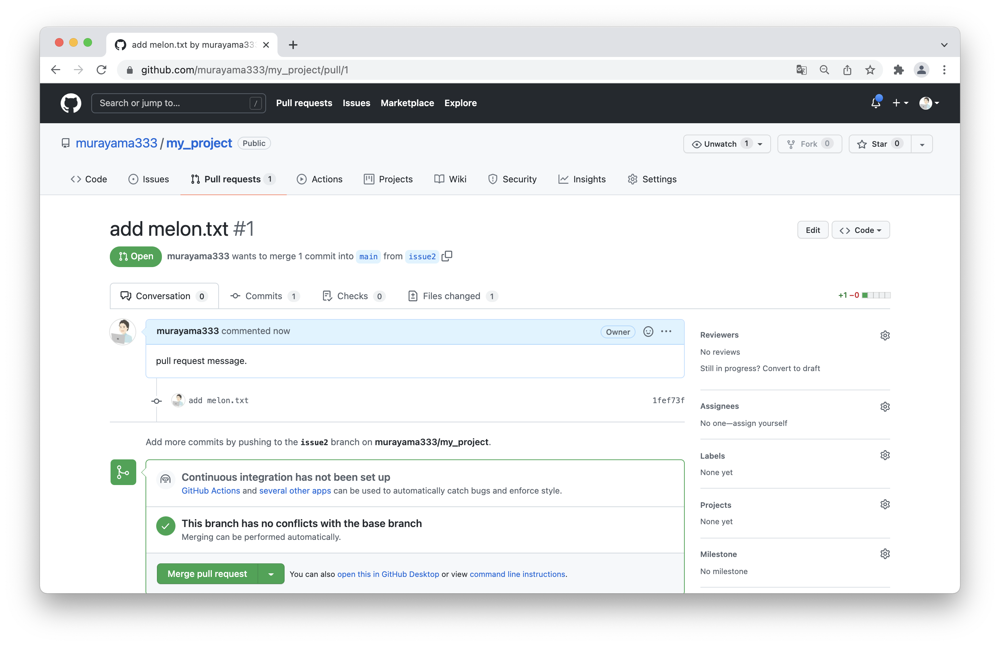
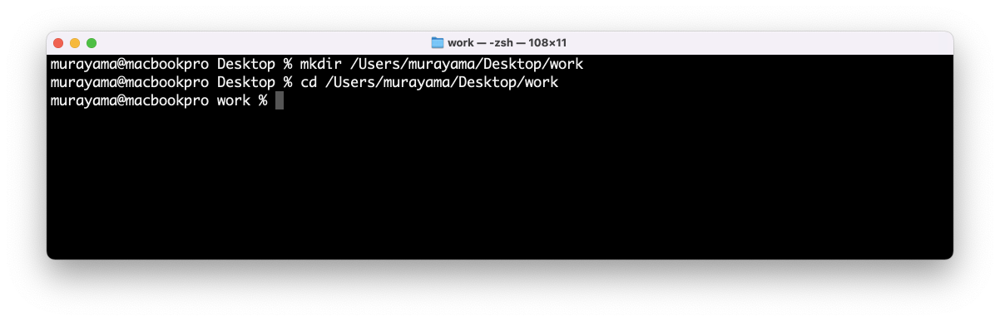
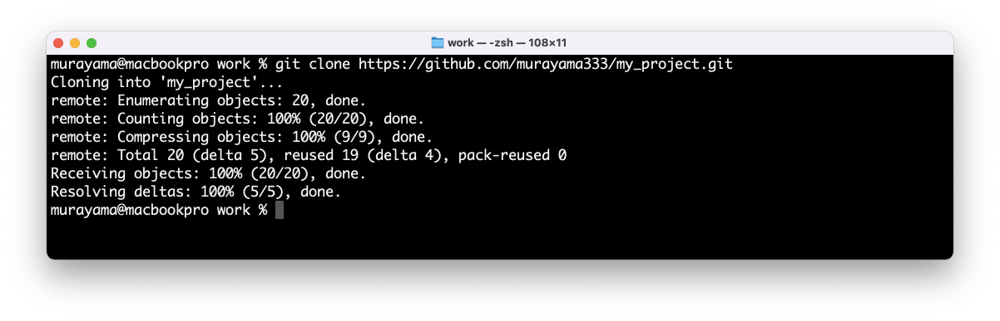
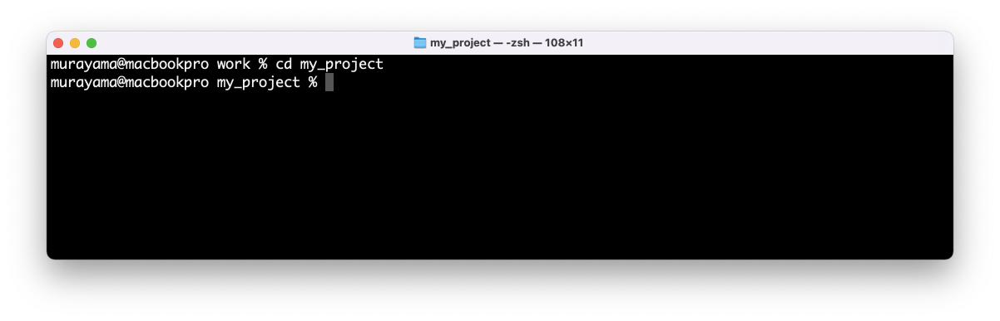
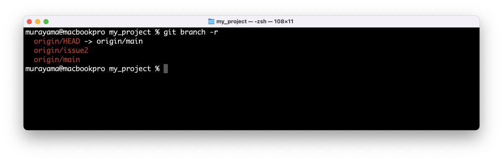
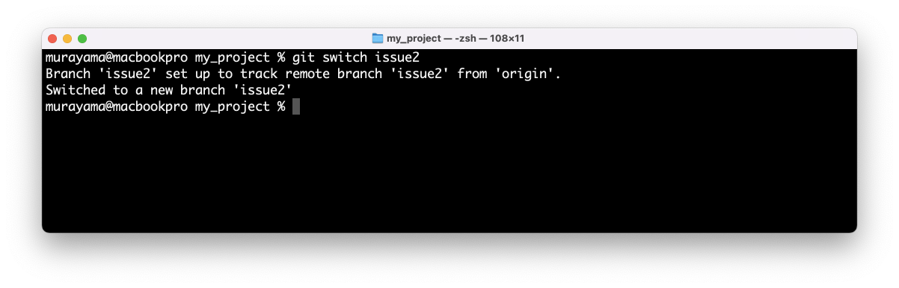

# Git - チュートリアル

## Agenda

* Gitの使い方1 - ローカル編
* Gitの使い方2 - リモート編
* Gitの使い方3 - ローカル（ブランチ）編
* **Gitの使い方4 - リモート（ブランチ）編**

---

## Gitの使い方4 - リモート（ブランチ）編

+ 作成したプログラムのレビューを受ける場合
    + `git push` - **ブランチ名を指定して**ローカルリポジトリの更新をリモートリポジトリに反映する
+ 作成したプログラムをレビューする場合
    + `git fetch` - **ブランチ名を指定して**リモートリポジトリの更新をローカルリポジトリに反映する（マージしない）

---

## チュートリアル

### 作成したプログラムのレビューを受ける場合

ここでは以下の手順を確認します。

1. ローカルリポジトリに `issue2` ブランチを作成する
2. `issue2` ブランチで `melon.txt` ファイルを追加する（ `commit` する）
3. `issue2` ブランチを リモートリポジトリ（ `orign` ） に反映する（ `push` する）
4. GitHub 上で pull request を作成する

---

#### 1. ローカルリポジトリに `issue2` ブランチを作成する

`git switch` コマンドで `issue2` ブランチを作成する。

```
% git switch -c issue2
Switched to a new branch 'issue2'
```



---

#### 2. `issue2` ブランチで `melon.txt` ファイルを追加する（ `commit` する）

`melon.txt` ファイルを作成してリポジトリにコミットする。

```
% echo Melon > melon.txt
% git add .
% git commit -m "add melon.txt"
[issue2 1fef73f] add melon.txt
 1 file changed, 1 insertion(+)
 create mode 100644 melon.txt
```



---

#### 3. `issue2` ブランチを リモートリポジトリ（ `orign` ） に反映する（ `push` する）

`git push` コマンドで `issue2` ブランチを リモートリポジトリ（ `origin` ）に `push` する。

```
% git push origin issue2
Enumerating objects: 4, done.
Counting objects: 100% (4/4), done.
Delta compression using up to 8 threads
Compressing objects: 100% (2/2), done.
Writing objects: 100% (3/3), 270 bytes | 270.00 KiB/s, done.
Total 3 (delta 1), reused 0 (delta 0), pack-reused 0
remote: Resolving deltas: 100% (1/1), completed with 1 local object.
remote: 
remote: Create a pull request for 'issue2' on GitHub by visiting:
remote:      https://github.com/murayama333/my_project/pull/new/issue2
remote: 
To https://github.com/murayama333/my_project.git
 * [new branch]      issue2 -> issue2
```



---

#### 4. GitHub 上で pull request を作成する

GitHubにアクセスすると `Compare & pull request` ボタンが表示されるので、ボタンをクリックして pull request を作成する。


表示された画面において、pull request のメッセージを入力して `Create pull request` ボタンをクリックする。



以下のような pull request が作成される。



> 以降は他の開発者にコードレビューを依頼して、問題なければマージすることになります。

---

## チュートリアル

### 作成したプログラムのレビューをする場合

ここでは以下の手順を確認します。

1. 事前準備：動作確認のために、あらためてリモートリポジトリからローカルリポジトリを作成しておく
2. リモートリポジトリから `issue2` ブランチをマージせずに取得する
3. ローカルに `issue2` ブランチを作成する

---

#### 1. 事前準備：動作確認のために、あらためてリモートリポジトリからローカルリポジトリを作成しておく

> この作業はGitの学習のために行います。本来の業務では不要です。

デスクトップに動作確認用のフォルダ（ `work` ）を作成し、作業フォルダを移動する

```
% mkdir /Users/murayama/Desktop/work
% cd /Users/murayama/Desktop/work 
```



`git clone` コマンドでリモートリポジトリからローカルリポジトリを作成する

```
% git clone https://github.com/murayama333/my_project.git
Cloning into 'my_project'...
remote: Enumerating objects: 20, done.
remote: Counting objects: 100% (20/20), done.
remote: Compressing objects: 100% (9/9), done.
remote: Total 20 (delta 5), reused 19 (delta 4), pack-reused 0
Receiving objects: 100% (20/20), done.
Resolving deltas: 100% (5/5), done.
```



作業フォルダを `my_project` に移動する。

```
% cd my_project
```



---

#### 2. リモートリポジトリから `issue2` ブランチをマージせずに取得する

`git fetch` コマンドでリモートリポジトリの更新内容をローカルリポジトリに反映する

```
% git fetch origin
```


`git branch` コマンドでリモートブランチ（リモート追跡ブランチ）の一覧を確認する

```
% git branch -r
  origin/HEAD -> origin/main
  origin/issue2
  origin/main
```



> `origin/issue2` が確認できます。

---

#### 3. ローカルに `issue2` ブランチを作成する

`origin/issue2` からローカルリポジトリに `issue2` ブランチを作成する

```
% git switch issue2
Branch 'issue2' set up to track remote branch 'issue2' from 'origin'.
Switched to a new branch 'issue2'
```



`ls` コマンドで作業フォルダを確認すると `melon.txt` ファイルを確認できる。

```
% ls
apple.txt	banana.txt	lemon.txt	melon.txt	orange.txt
```

> 以降はコードレビューを実施して問題なければ `main` ブランチにマージします。